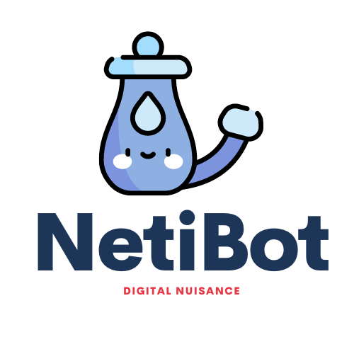
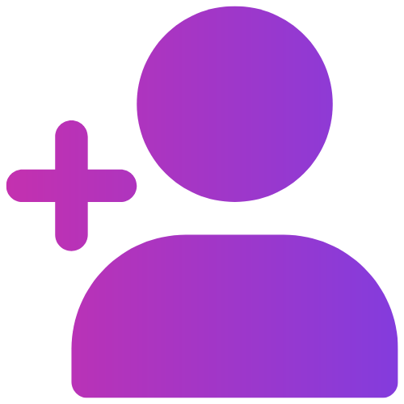

# NetiBot

# Built with

       

# What IS NetiBot??  
**Quite simply, NetiBot is a Discord nuisance and lavage bot - if you've ever wanted to annoy your friends, but not put out the work of doing it. The bot is programmed to react to trigger words within Discord chat prompting a specific response, such as responding to the word 'wow' with a random clip from a 3rd party API that generates a random "Wow" from an Owen Wilson film. The bot has also studied under the tutelage of the renowned Hennig Brand whose archaic medical expertise is stored in a Mongo DB and ailments and treatments are called if the Discord user types "sick" or "ill" in the chat.**

# Commands
Command|Description
--- | ---
/cat|Returns a random cat fact.
/chuck|Returns a random Chuck Norris fact(joke).
/lavage[number]|Bulk deletes the last [number] messages in the channel.
/meme|Returns a random meme from the meme API.
/urban[word]|Returns the definition of [word] from the Urban Dictionary API.
/webmd|Responds with a horrible diagnosis and treatment.
/wow|Returns a random "Wow" from the Owen Wilson film API.

# Events
Event|Description
--- | ---
birthday/bday|Responds with birthday gif and birthday song video.
brb|Responds with a brb gif and hold music.
lol|Responds with a fun video.
no u|Responds with a no u gif.
sick/ill/unwell|Responds with a horrible diagnosis and treatment.
sad|Responds with a sad video.
wow|Responds with a random "Wow" from the Owen Wilson film API and increments the amount of wows its seen.
wtf|Responds with a wtf gif.

# Invite Link   

# NetiBot Team

Cody Wise:  
 | 

Mohamed Amin:  
 | 

Kevin Roney:  
 | 

Jeffrey Allison:  
 | 